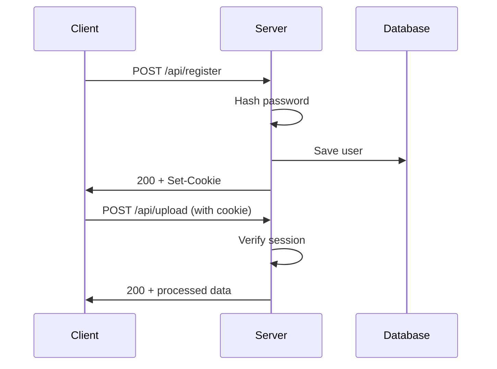

# API Documentation

Base URL: `http://localhost:5000/api`

All endpoints use JSON for request/response bodies unless otherwise specified.

## Authentication

All endpoints except `/register`, `/login`, `/template`, and `/health` require authentication via session cookies.

### Register User

**POST** `/api/register`

Create a new user account.

**Request Body:**
```json
{
  "username": "string (required, unique)",
  "password": "string (required, min 6 chars)"
}
```

**Success Response (200):**
```json
{
  "message": "User registered",
  "user": {
    "id": "uuid",
    "username": "string"
  }
}
```

**Error Responses:**
- `400` - Missing username or password
- `409` - Username already exists
- `500` - Server error

---

### Login

**POST** `/api/login`

Authenticate a user and create a session.

**Request Body:**
```json
{
  "username": "string (required)",
  "password": "string (required)"
}
```

**Success Response (200):**
```json
{
  "message": "Login successful",
  "user": {
    "id": "uuid",
    "username": "string"
  }
}
```

Sets session cookie: `connect.sid`

**Error Responses:**
- `401` - Invalid username or password
- `500` - Server error

---

### Logout

**POST** `/api/logout`

End the current session.

**Success Response (200):**
```json
{
  "message": "Logged out"
}
```

Clears session cookie.

---

## Profile Management

### Get Profile

**GET** `/api/profile`

Get the current user's profile information.

**Success Response (200):**
```json
{
  "id": "uuid",
  "username": "string",
  "letters": ["A", "B", "C", ...]
}
```

**Error Responses:**
- `401` - Not authenticated
- `404` - User not found

---

### Download Template

**GET** `/api/template`

Download the handwriting template PDF.

**Success Response (200):**
- Content-Type: `application/pdf`
- Content-Disposition: `attachment; filename="handwriting_template.pdf"`
- Binary PDF data

**Error Responses:**
- `404` - Template file not found

---

### Upload Handwriting Sheet

**POST** `/api/upload`

Upload a scanned handwriting sheet for processing.

**Request:**
- Content-Type: `multipart/form-data`
- Field name: `sheet`
- Accepted types: `image/png`, `image/jpeg`, `application/pdf`

**Success Response (200):**
```json
{
  "message": "Sheet processed successfully",
  "chars": ["A", "B", "C", "H", "E", "L", "O"]
}
```

**Error Responses:**
- `400` - No file uploaded
- `401` - Not authenticated
- `500` - Processing failed

**Notes:**
- Image is processed with OpenCV to extract individual characters
- Extracted characters are saved to user's profile
- Original upload is deleted after processing

---

### Save Drawn Character

**POST** `/api/save-char`

Save a character drawn on the canvas.

**Request Body:**
```json
{
  "char": "A",
  "strokes": [
    [
      { "x": 20, "y": 50 },
      { "x": 40, "y": 10 },
      { "x": 60, "y": 50 }
    ],
    [
      { "x": 30, "y": 35 },
      { "x": 50, "y": 35 }
    ]
  ]
}
```

**Success Response (200):**
```json
{
  "message": "Character A saved"
}
```

**Error Responses:**
- `400` - Missing char or strokes data
- `401` - Not authenticated

**Notes:**
- Strokes are arrays of points (x, y coordinates)
- Each stroke represents one continuous line
- Data is stored as vector paths in user profile

---

## PDF Generation

### Generate Handwritten PDF

**POST** `/api/generate`

Generate a PDF with text rendered in the user's handwriting.

**Request Body:**
```json
{
  "text": "Hello World\nThis is my handwritten note!",
  "paperSize": "Letter"
}
```

**Parameters:**
- `text` (required): The message to render
- `paperSize` (required): `"Letter"` or `"A4"`

**Success Response (200):**
- Content-Type: `application/pdf`
- Binary PDF data stream

**Error Responses:**
- `400` - User profile not found or incomplete
- `401` - Not authenticated
- `500` - PDF generation failed

**Notes:**
- Characters not in profile are skipped
- Supports both image-based and vector-based characters
- Handles line breaks (`\n`)
- Auto-wraps text to page width
- Creates multiple pages as needed

---

## Health Check

### Server Health

**GET** `/api/health`

Check if the server is running.

**Success Response (200):**
```json
{
  "status": "OK"
}
```

---

## Data Formats

### User Profile Structure

```json
{
  "id": "uuid",
  "username": "string",
  "passwordHash": "bcrypt hash",
  "profile": {
    "letters": {
      "A": {
        "type": "image",
        "fileName": "A.png"
      },
      "B": {
        "type": "vector",
        "strokes": [
          [{ "x": 0, "y": 0 }, ...]
        ]
      }
    }
  }
}
```

### Character Types

**Image Character:**
```json
{
  "type": "image",
  "fileName": "A.png"
}
```
- Stored in `backend/data/uploads/<userId>/`
- PNG format
- Cropped from uploaded sheet

**Vector Character:**
```json
{
  "type": "vector",
  "strokes": [
    [
      { "x": 20, "y": 50 },
      { "x": 40, "y": 10 }
    ]
  ]
}
```
- Drawn on canvas
- Array of stroke paths
- Each stroke is array of {x, y} points

---

## Error Handling

All errors follow this format:

```json
{
  "error": "Error message description"
}
```

### Common HTTP Status Codes

- `200` - Success
- `400` - Bad Request (invalid input)
- `401` - Unauthorized (not authenticated)
- `404` - Not Found
- `409` - Conflict (duplicate resource)
- `500` - Internal Server Error

---

## Rate Limiting

Currently no rate limiting is implemented.

**Recommended for production:**
- Login: 5 attempts per 15 minutes
- Register: 3 attempts per hour
- Upload: 10 per hour
- Generate: 50 per hour

---

## CORS

Currently configured for local development.

**For production:**
- Set `CORS_ORIGIN` environment variable
- Whitelist specific domains
- Enable credentials

---

## Authentication Flow



---

## Example Usage

### Register and Login

```javascript
// Register
const registerRes = await fetch('/api/register', {
  method: 'POST',
  headers: { 'Content-Type': 'application/json' },
  credentials: 'include',
  body: JSON.stringify({
    username: 'john',
    password: 'securepass123'
  })
});

// Login
const loginRes = await fetch('/api/login', {
  method: 'POST',
  headers: { 'Content-Type': 'application/json' },
  credentials: 'include',
  body: JSON.stringify({
    username: 'john',
    password: 'securepass123'
  })
});
```

### Upload Handwriting Sheet

```javascript
const formData = new FormData();
formData.append('sheet', fileInput.files[0]);

const res = await fetch('/api/upload', {
  method: 'POST',
  credentials: 'include',
  body: formData
});
```

### Generate PDF

```javascript
const res = await fetch('/api/generate', {
  method: 'POST',
  headers: { 'Content-Type': 'application/json' },
  credentials: 'include',
  body: JSON.stringify({
    text: 'Hello World!',
    paperSize: 'Letter'
  })
});

const blob = await res.blob();
const url = URL.createObjectURL(blob);
window.open(url);
```

---

## Future Enhancements

- [ ] OAuth2 integration
- [ ] JWT tokens as alternative to sessions
- [ ] WebSocket support for real-time updates
- [ ] Pagination for large datasets
- [ ] Batch operations
- [ ] GraphQL API option
