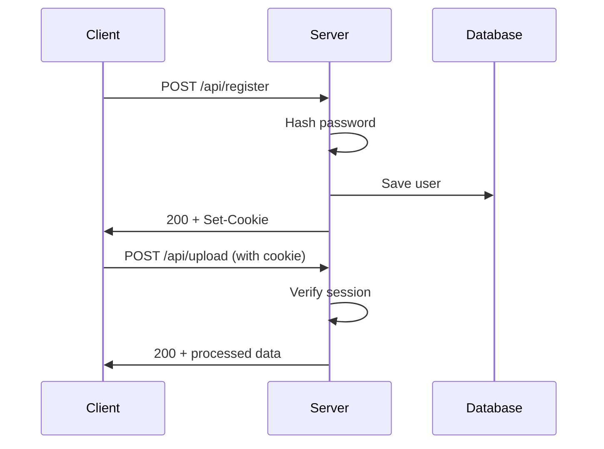

# API Documentation

Base URL: `http://localhost:5000/api`

All endpoints use JSON for request/response bodies unless otherwise specified.

## Authentication

All endpoints except `/register`, `/login`, `/template`, and `/health` require authentication via session cookies.

### Register User

**POST** `/api/register`

Create a new user account.

**Request Body:**
```json
{
  "username": "string (required, unique)",
  "password": "string (required, min 6 chars)"
}
```

**Success Response (200):**
```json
{
  "message": "User registered",
  "user": {
    "id": "uuid",
    "username": "string"
  }
}
```

**Error Responses:**
- `400` - Missing username or password
- `409` - Username already exists
- `500` - Server error

---

### Login

**POST** `/api/login`

Authenticate a user and create a session.

**Request Body:**
```json
{
  "username": "string (required)",
  "password": "string (required)"
}
```

**Success Response (200):**
```json
{
  "message": "Login successful",
  "user": {
    "id": "uuid",
    "username": "string"
  }
}
```

Sets session cookie: `connect.sid`

**Error Responses:**
- `401` - Invalid username or password
- `500` - Server error

---

### Logout

**POST** `/api/logout`

End the current session.

**Success Response (200):**
```json
{
  "message": "Logged out"
}
```

Clears session cookie.

---

## Profile Management

### Get Profile

**GET** `/api/profile`

Get the current user's profile information.

**Success Response (200):**
```json
{
  "id": "uuid",
  "username": "string",
  "letters": ["A", "B", "C", ...]
}
```

**Error Responses:**
- `401` - Not authenticated
- `404` - User not found

---

### Download Template

**GET** `/api/template`

Download the handwriting template PDF.

**Success Response (200):**
- Content-Type: `application/pdf`
- Content-Disposition: `attachment; filename="handwriting_template.pdf"`
- Binary PDF data

**Error Responses:**
- `404` - Template file not found

---

### Upload Handwriting Sheet

**POST** `/api/upload`

Upload a scanned handwriting sheet for processing.

**Request:**
- Content-Type: `multipart/form-data`
- Field name: `sheet`
- Accepted types: `image/png`, `image/jpeg`, `application/pdf`

**Success Response (200):**
```json
{
  "message": "Sheet processed successfully",
  "chars": ["A", "B", "C", "H", "E", "L", "O"]
}
```

**Error Responses:**
- `400` - No file uploaded
- `401` - Not authenticated
- `500` - Processing failed

**Notes:**
- Image is processed with OpenCV to extract individual characters
- Extracted characters are saved to user's profile
- Original upload is deleted after processing

---

### Save Drawn Character

**POST** `/api/save-char`

Save a character drawn on the canvas.

**Request Body:**
```json
{
  "char": "A",
  "strokes": [
    [
      { "x": 20, "y": 50 },
      { "x": 40, "y": 10 },
      { "x": 60, "y": 50 }
    ],
    [
      { "x": 30, "y": 35 },
      { "x": 50, "y": 35 }
    ]
  ]
}
```

**Success Response (200):**
```json
{
  "message": "Character A saved"
}
```

**Error Responses:**
- `400` - Missing char or strokes data
- `401` - Not authenticated

**Notes:**
- Strokes are arrays of points (x, y coordinates)
- Each stroke represents one continuous line
- Data is stored as vector paths in user profile

---

## PDF Generation

### Generate Handwritten PDF

**POST** `/api/generate`

Generate a PDF with text rendered in the user's handwriting.

**Request Body:**
```json
{
  "text": "Hello World\nThis is my handwritten note!",
  "paperSize": "Letter"
}
```

**Parameters:**
- `text` (required): The message to render
- `paperSize` (required): `"Letter"` or `"A4"`

**Success Response (200):**
- Content-Type: `application/pdf`
- Binary PDF data stream

**Error Responses:**
- `400` - User profile not found or incomplete
- `401` - Not authenticated
- `500` - PDF generation failed

**Notes:**
- Characters not in profile are skipped
- Supports both image-based and vector-based characters
- Handles line breaks (`\n`)
- Auto-wraps text to page width
- Creates multiple pages as needed

---

## Font Generation

### Generate Font

**POST** `/api/font/generate`

Generate TrueType (TTF) and web (WOFF2) fonts from the user's handwriting.

**Request Body:**
```json
{
  "familyName": "MyHandwriting",
  "styleName": "Regular",
  "regenerate": false
}
```

**Parameters:**
- `familyName` (optional): Custom font family name (defaults to `{username}Handwriting`)
- `styleName` (optional): Font style name (default: `"Regular"`)
- `regenerate` (optional): Force regeneration if font already exists (default: `false`)

**Success Response (200):**
```json
{
  "message": "Font generated successfully",
  "success": true,
  "familyName": "JohnHandwriting",
  "styleName": "Regular",
  "fullName": "JohnHandwriting Regular",
  "glyphCount": 54,
  "characterCount": 53,
  "characters": ["A", "B", "C", ...],
  "skippedCharacters": ["X", "Y"],
  "files": {
    "ttf": "/path/to/userId.ttf",
    "woff2": "/path/to/userId.woff2",
    "css": "/path/to/userId.css"
  },
  "paths": {
    "ttf": "/api/font/download/userId/ttf",
    "woff2": "/api/font/download/userId/woff2",
    "css": "/api/font/css/userId"
  }
}
```

**Error Responses:**
- `400` - No vector characters available
- `401` - Not authenticated
- `500` - Font generation failed

**Notes:**
- Only vector-drawn characters are included in fonts
- Image-based characters are automatically skipped
- Font uses 1000 units per em, 800 ascender, -200 descender
- Generates TTF (desktop) and WOFF2 (web) formats
- Creates @font-face CSS file automatically

---

### Get Font Info

**GET** `/api/font/info`

Get metadata about the user's generated font.

**Success Response (200):**
```json
{
  "familyName": "JohnHandwriting",
  "characterCount": 53,
  "characters": ["A", "B", "C", ...],
  "skippedCharacters": ["X", "Y"],
  "formats": {
    "ttf": true,
    "woff2": true,
    "css": true
  },
  "paths": {
    "ttf": "/api/font/download/userId/ttf",
    "woff2": "/api/font/download/userId/woff2",
    "css": "/api/font/css/userId"
  }
}
```

**Error Responses:**
- `401` - Not authenticated
- `404` - Font not found

---

### Download Font

**GET** `/api/font/download/:userId/:format`

Download a generated font file.

**Parameters:**
- `userId` (required): User ID (must match session user)
- `format` (required): `"ttf"` or `"woff2"`

**Success Response (200):**
- TTF: Content-Type: `font/ttf`
- WOFF2: Content-Type: `font/woff2`
- Content-Disposition: `attachment; filename="{FamilyName}.{format}"`
- Binary font file data

**Error Responses:**
- `400` - Invalid format
- `401` - Not authenticated
- `403` - Unauthorized (userId doesn't match session)
- `404` - Font file not found

**Notes:**
- TTF files are for desktop installation (Windows, Mac, Linux)
- WOFF2 files are optimized for web use (smaller file size)
- Font files are cached per user and regenerated only when requested

---

### Get Font CSS

**GET** `/api/font/css/:userId`

Get the @font-face CSS for embedding the font on websites.

**Parameters:**
- `userId` (required): User ID (must match session user)

**Success Response (200):**
- Content-Type: `text/css`
- CSS content with @font-face declaration

**Response Example:**
```css
/**
 * Custom Handwriting Font
 * Generated by Handwriting App
 */

@font-face {
  font-family: 'JohnHandwriting';
  src: url('/api/font/download/userId/woff2') format('woff2');
  font-weight: normal;
  font-style: normal;
  font-display: swap;
}

/* Usage example:
 * body {
 *   font-family: 'JohnHandwriting', cursive, sans-serif;
 * }
 */
```

**Error Responses:**
- `401` - Not authenticated
- `403` - Unauthorized
- `404` - CSS file not found

---

### Delete Font

**DELETE** `/api/font`

Delete all generated font files for the current user.

**Success Response (200):**
```json
{
  "message": "Font files deleted successfully"
}
```

**Error Responses:**
- `401` - Not authenticated
- `404` - No font files found

**Notes:**
- Deletes TTF, WOFF2, and CSS files
- Font can be regenerated at any time
- Does not affect character data in user profile

---

## Health Check

### Server Health

**GET** `/api/health`

Check if the server is running and get health metrics.

**Success Response (200):**
```json
{
  "status": "OK",
  "timestamp": "2025-11-17T14:42:30.123Z",
  "uptime": 12345.678,
  "environment": "development",
  "memory": {
    "total": "50 MB",
    "used": "35 MB",
    "external": "5 MB"
  },
  "cpu": {
    "user": 123456,
    "system": 78901
  }
}
```

**Notes:**
- This endpoint is public (no authentication required)
- Useful for monitoring and health checks
- Returns real-time server metrics

---

## Data Formats

### User Profile Structure

```json
{
  "id": "uuid",
  "username": "string",
  "passwordHash": "bcrypt hash",
  "profile": {
    "letters": {
      "A": {
        "type": "image",
        "fileName": "A.png"
      },
      "B": {
        "type": "vector",
        "strokes": [
          [{ "x": 0, "y": 0 }, ...]
        ]
      }
    }
  }
}
```

### Character Types

**Image Character:**
```json
{
  "type": "image",
  "fileName": "A.png"
}
```
- Stored in `backend/data/uploads/<userId>/`
- PNG format
- Cropped from uploaded sheet

**Vector Character:**
```json
{
  "type": "vector",
  "strokes": [
    [
      { "x": 20, "y": 50 },
      { "x": 40, "y": 10 }
    ]
  ]
}
```
- Drawn on canvas
- Array of stroke paths
- Each stroke is array of {x, y} points

---

## Error Handling

All errors follow this format:

```json
{
  "error": "Error message description"
}
```

### Common HTTP Status Codes

- `200` - Success
- `400` - Bad Request (invalid input)
- `401` - Unauthorized (not authenticated)
- `404` - Not Found
- `409` - Conflict (duplicate resource)
- `500` - Internal Server Error

---

## Rate Limiting

Rate limiting is now implemented to protect against abuse.

**Current Limits:**
- General API: 100 requests per 15 minutes
- Login: 5 attempts per 15 minutes (skips successful logins)
- Register: 3 attempts per 15 minutes
- Upload: 10 uploads per 15 minutes

**Configuration:**
Rate limiting can be disabled or configured via environment variables:
- `ENABLE_RATE_LIMIT=true/false`
- `RATE_LIMIT_WINDOW_MS=900000` (15 minutes in milliseconds)
- `RATE_LIMIT_MAX_REQUESTS=100`

**Rate Limit Response (429):**
```json
{
  "error": "Too many requests. Please try again later.",
  "retryAfter": 900
}
```

---

## CORS

Cross-Origin Resource Sharing (CORS) is now implemented.

**Configuration:**
- Enabled by default
- Supports credentials (cookies)
- Configurable via environment variables

**Environment Variables:**
- `ENABLE_CORS=true/false` (default: true)
- `CORS_ORIGIN=http://localhost:3000,https://yourdomain.com` (comma-separated list)

**Allowed Methods:**
- GET, POST, PUT, DELETE, OPTIONS

**Allowed Headers:**
- Content-Type, Authorization

**Default Origins:**
- Development: `http://localhost:3000`
- Production: Configure via `CORS_ORIGIN` environment variable

---

## Authentication Flow



---

## Example Usage

### Register and Login

```javascript
// Register
const registerRes = await fetch('/api/register', {
  method: 'POST',
  headers: { 'Content-Type': 'application/json' },
  credentials: 'include',
  body: JSON.stringify({
    username: 'john',
    password: 'securepass123'
  })
});

// Login
const loginRes = await fetch('/api/login', {
  method: 'POST',
  headers: { 'Content-Type': 'application/json' },
  credentials: 'include',
  body: JSON.stringify({
    username: 'john',
    password: 'securepass123'
  })
});
```

### Upload Handwriting Sheet

```javascript
const formData = new FormData();
formData.append('sheet', fileInput.files[0]);

const res = await fetch('/api/upload', {
  method: 'POST',
  credentials: 'include',
  body: formData
});
```

### Generate PDF

```javascript
const res = await fetch('/api/generate', {
  method: 'POST',
  headers: { 'Content-Type': 'application/json' },
  credentials: 'include',
  body: JSON.stringify({
    text: 'Hello World!',
    paperSize: 'Letter'
  })
});

const blob = await res.blob();
const url = URL.createObjectURL(blob);
window.open(url);
```

### Generate and Download Font

```javascript
// Generate font
const generateRes = await fetch('/api/font/generate', {
  method: 'POST',
  headers: { 'Content-Type': 'application/json' },
  credentials: 'include',
  body: JSON.stringify({
    familyName: 'MyHandwriting',
    regenerate: false
  })
});

const fontData = await generateRes.json();
console.log(`Font generated: ${fontData.characterCount} characters`);

// Download TTF for desktop
window.open(`/api/font/download/${userId}/ttf`, '_blank');

// Download WOFF2 for web
window.open(`/api/font/download/${userId}/woff2`, '_blank');

// Get CSS for embedding
const cssRes = await fetch(`/api/font/css/${userId}`, {
  credentials: 'include'
});
const css = await cssRes.text();
console.log('Font CSS:', css);

// Check font info
const infoRes = await fetch('/api/font/info', {
  credentials: 'include'
});
const info = await infoRes.json();
console.log('Available characters:', info.characters);
console.log('Skipped characters:', info.skippedCharacters);
```

---

## Future Enhancements

- [ ] OAuth2 integration (Auth0)
- [ ] JWT tokens as alternative to sessions
- [ ] Font kerning and ligature support
- [ ] Multiple font weights (Light, Regular, Bold)
- [ ] Image-to-vector conversion for uploaded characters
- [ ] WebSocket support for real-time updates
- [ ] Pagination for large datasets
- [ ] Batch operations
- [ ] GraphQL API option
- [ ] Font preview/testing endpoint
- [ ] Custom font metrics configuration
